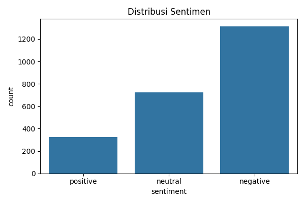
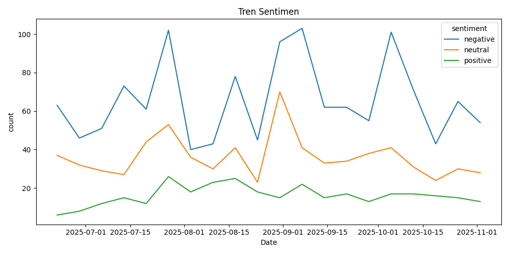

# Biznet Twitter Sentiment Analysis

[](https://biznet-sentiment-analysis.streamlit.app)

## 📊 Live Demo
Try the live application here: [Biznet Sentiment Analysis App](https://biznet-sentiment-analysis.streamlit.app)



## 🎯 Project Overview
This project analyzes customer sentiment from Twitter discussions about Biznet Internet Service Provider using Natural Language Processing and Machine Learning. The analysis is performed using IndoRoBERTa model fine-tuned for Indonesian sentiment analysis.

## ✨ Features
- Real-time sentiment analysis visualization
- Interactive dashboard with filters
- Keyword extraction and analysis
- Trend analysis over time
- Word clouds for positive and negative sentiments

## 🛠️ Tech Stack
- Python
- Streamlit
- HuggingFace Transformers (IndoRoBERTa)
- Pandas & NumPy
- Plotly & Matplotlib
- Scikit-learn

## 📦 Installation & Usage

1. Clone the repository
```bash
git clone https://github.com/Fikri645/biznet-sentiment-analysis.git
cd biznet-sentiment-analysis
```

2. Install dependencies
```bash
pip install -r requirements.txt
```

3. Run the Streamlit app
```bash
streamlit run app/streamlit_app.py
```

## 📁 Project Structure
```
biznet-sentiment-analysis/
├── app/
│   └── streamlit_app.py      # Main Streamlit application
├── data/
│   ├── figures/              # Generated visualizations
│   ├── slang.csv            # Indonesian slang dictionary
│   └── *_public.csv         # Public dataset samples
├── src/
│   ├── __init__.py
│   ├── analysis.py          # Analysis utilities
│   ├── preprocess.py        # Data preprocessing
│   ├── sentiment.py         # Sentiment analysis
│   └── utils.py            # Helper functions
└── requirements.txt         # Project dependencies
```

## 📈 Sample Results


## 📝 License
This project is licensed under the MIT License - see the [LICENSE](LICENSE) file for details.

## 👨‍💻 Author
- [Fikri Wahidin](https://github.com/Fikri645)

This project analyzes sentiment from tweets related to Biznet (Indonesian Internet Service Provider) using Natural Language Processing techniques. The analysis covers tweets collected from June 19, 2025, to October 31, 2025.

## Data Collection

- **Source**: Twitter API via [TwitterAPI.io](https://twitterapi.io/)
- **Query Parameters**:
  ```
  "Biznet" OR "#Biznet" lang:in -filter:links since:2025-06-19_00:00:00_UTC until:2025-10-31_23:59:59_UTC (Latest)
  ```
- **Language Filter**: Indonesian (lang:in)
- **Period**: June 19, 2025 - October 31, 2025

### Data Privacy Notes
- Tweet IDs and URLs have been anonymized in the shared dataset
- Original identifiers have been replaced with sequential numbers
- This anonymization is done to protect user privacy while maintaining data usability
- The complete dataset structure is preserved, only identifiable information is masked

### Slang Dictionary Sources

The project uses a comprehensive Indonesian slang dictionary compiled from multiple sources:
1. [Hugging Face Indonesia Slang Dataset](https://huggingface.co/datasets/theonlydo/indonesia-slang) - A community-maintained collection of Indonesian slang words and their formal equivalents
2. Custom additions specific to social media and Twitter conversations

The slang dictionary is stored in `data/slang.csv` and is used during the text preprocessing phase to normalize informal language into standard Indonesian.

## Project Structure

```
├── app/
│   └── streamlit_app.py      # Streamlit web application
├── data/
│   ├── biznet_tweets_raw.csv     # Raw collected tweets
│   ├── biznet_tweets_clean.csv   # Preprocessed tweets
│   ├── biznet_tweets_sentiment.csv # Tweets with sentiment labels
│   ├── slang.csv                  # Indonesian slang dictionary
│   └── figures/                   # Generated visualizations
├── src/
│   ├── preprocess.py     # Text preprocessing functions
│   ├── sentiment.py      # Sentiment analysis implementation
│   ├── analysis.py       # Data analysis and visualization
│   └── utils.py          # Utility functions
└── requirements.txt      # Project dependencies
```

## Features

- Tweet preprocessing and cleaning
- Sentiment analysis of Indonesian tweets
- Interactive visualization dashboard using Streamlit
- Support for Indonesian slang word normalization

## Streamlit Dashboard Features

The Streamlit dashboard (`app/streamlit_app.py`) provides comprehensive analytics and visualization capabilities:

### 1. Dashboard Tab
- Overall sentiment distribution (pie chart)
- Weekly sentiment trends visualization
- Key metrics: total tweets, positive/negative percentages
- Sample tweet display with sentiment labels
- Interactive wordclouds for positive and negative sentiments

### 2. Keyword Extraction Tab
- Unigram analysis with frequency counts and visualizations
- TF-IDF term analysis for identifying characteristic terms per sentiment
- Bigram analysis using PMI-like scoring
- Customizable stopwords through the sidebar
- Option to use original or normalized text tokens

### 3. Interpretation Tab
- Automatic summary generation of sentiment analysis results
- Quantitative overview of sentiment distribution
- Key themes identification for positive and negative sentiments
- Trend analysis and peak detection
- Downloadable interpretation report in Markdown format

### Dashboard Controls
- Minimum likes filter in sidebar
- Sentiment selection filter
- Toggle between original and normalized text analysis
- Customizable stopwords management
- Sample size adjustment for tweet examples

## Getting Started

1. **Clone the repository**
   ```bash
   git clone https://github.com/Fikri645/sentiment-biznet.git
   cd sentiment-biznet
   ```

2. **Create and activate virtual environment**
   ```bash
   # Windows
   python -m venv venv
   .\venv\Scripts\activate

   # Linux/Mac
   python3 -m venv venv
   source venv/bin/activate
   ```

3. **Install dependencies**
   ```bash
   pip install -r requirements.txt
   ```

4. **Prepare the data**
   - Place your Twitter data in `data/biznet_tweets_raw.csv`
   - Update `slang.csv` if needed with additional slang words

5. **Run the preprocessing pipeline**
   ```bash
   python src/preprocess.py
   python src/sentiment.py
   ```

6. **Run the Streamlit app**
   ```bash
   streamlit run app/streamlit_app.py
   ```

## Data Privacy and Ethics

- The raw Twitter data is not included in this repository for privacy reasons
- Make sure to follow Twitter's Terms of Service when collecting and using the data
- Remove any sensitive or personal information before sharing analysis results
- Consider anonymizing usernames and personal identifiers in the data

## Environment Setup

This project requires Python 3.8 or higher. Key dependencies:
- streamlit
- pandas
- scikit-learn
- Sastrawi (Indonesian NLP library)
- plotly
- wordcloud

See `requirements.txt` for complete dependencies.

## Data Processing Pipeline

1. **Data Collection**: Tweets are collected using TwitterAPI.io
2. **Preprocessing**: 
   - Text cleaning
   - Slang word normalization
   - Remove URLs, mentions, and special characters
3. **Sentiment Analysis**:
   - Text classification into positive, negative, or neutral sentiments
4. **Visualization**: Interactive dashboard for sentiment trends and insights

## License

This project is licensed under the MIT License - see the LICENSE file for details.

## Contributing

Feel free to open issues or submit pull requests for improvements.
